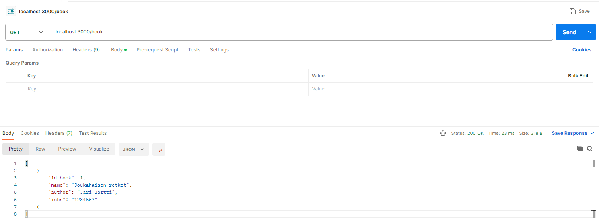
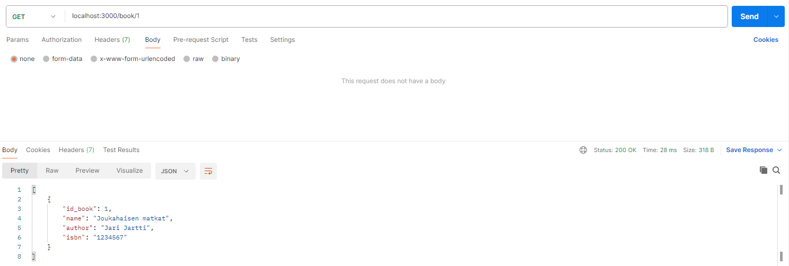
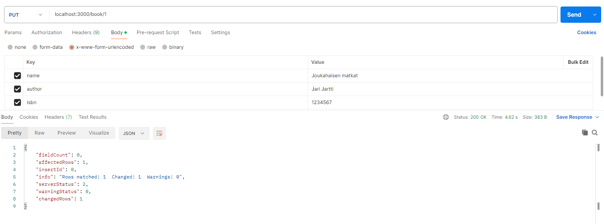
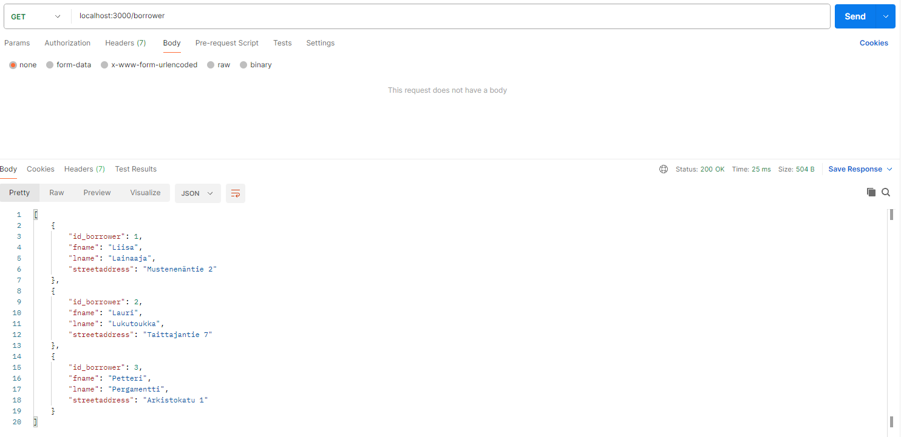
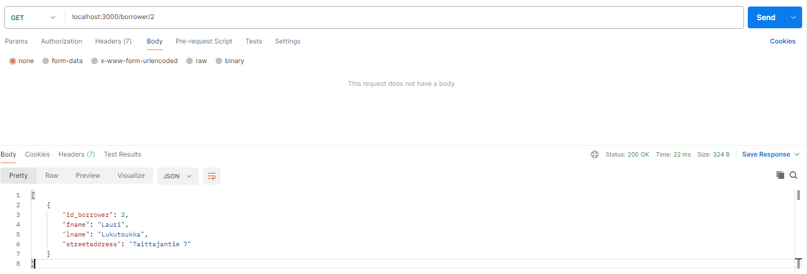
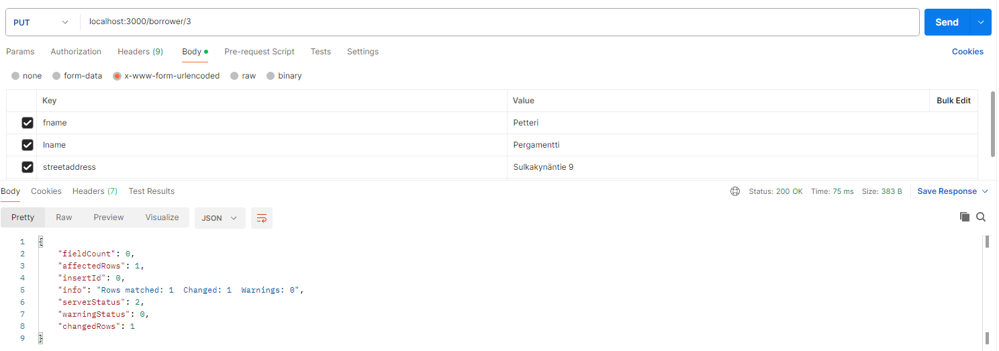
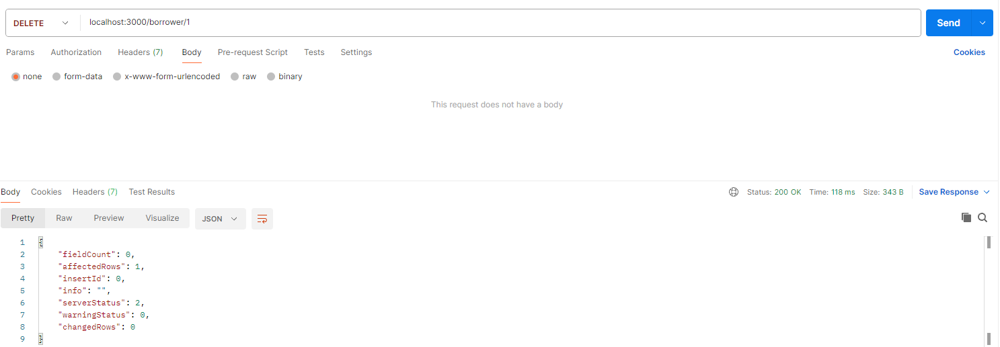

# Postman kyselyt

## Book-taulu

Tauluun lisääminen

Taulusta valitaan kaikki

Taulusta valitaan yksi

Taulun tietue päivitetään

Taulun tietue poistetaan

## Borrower-taulu

Tauluun lisääminen

Taulusta valitaan kaikki

Taulusta valitaan yksi

Taulun tietue päivitetään

Taulun tietue poistetaan

